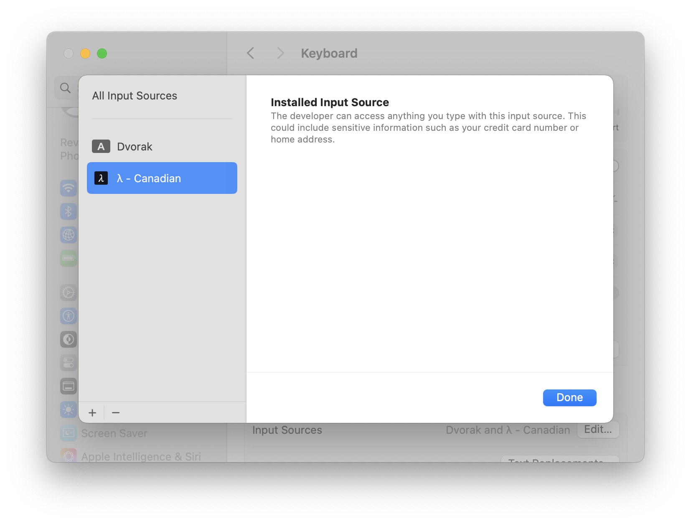

# λKeyboard

Are you tired of putting `Logos-` prefixes in front of every identifier? Do you want to be cool and use unicode characters where others think they shouldn't go?

λKeyboard (pronounced `LOH-gohs keyboard`) allows you to type `λ` characters with ease. It adds the lowercase lambda character to existing keylayouts on mac, so it can be used without requiring copy-pasting. The character is bound to existing symbol key so there is no conflicts with shortcuts and the base layout is otherwise unchanged.

Layouts Included:
- λ - Britsh
- λ - Canadian
- λ - Canadian - CSA

# Use

Press `Option-L` to insert a `λ` where ever you feel like it.

# Install

### Using the Installer

Download the latest `pkg` from [releases](https://github.com/jazzz/logos-keyboard/releases) and follow the install steps.

### Using brew:

`brew install jazzz/λKeyboard`

### Manually:

`cp logos-keyboard_*.bundle ~/Library/Keyboard\ Layouts/`

# Configuring 

Set the desired keyboard:

`System Settings -> Keyboard -> Text Input -> Input Sources (Edit)`

- Tap `+` to add Keyboard
- Select `λ - {Preferred Keyboard}
- Tap Add

## Security Warnings

MacOS treats all 3rd party keylayouts as potential key loggers and displays the following warning regardless of security implications.

The keylayout bundles used in this project contain only XML files which map, keycodes to characters. No code is executed or included in the bundle. Despiye warnings, developers cannot access any of your data.

Installers and bundles are deterministic and reproducible. Building locally or downloading the installers will generate the exact same artifacts.

# FAQ

- **My favorite layout is missing. Can it be added?**
  Any MacOS system keyboard is trivial to add. Open an issue with the:
    - Language
    - Layout Name
    - Preferred key (if L is not viable) 

    e.g: English - Dvorak - 37

- **I'm on linux. How can I use λ there?**
      🤷 
    `xmodmap -e "keycode 46 = l L Greek_lambda Greek_LAMBDA"`
